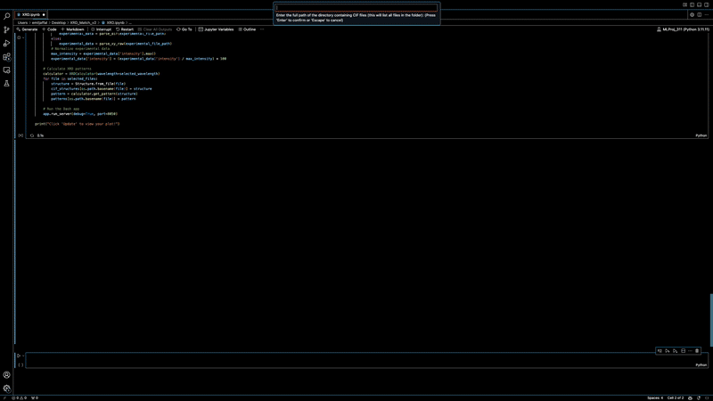

# XRD Matcher

[](https://github.com/OliynykLab/XRD-Matcher/blob/main/LICENSE)


This is an interactive software done in jupyter notebook for user-ease. It will plot a single chosen experimental x-ray diffraction (.xy) file and allow you to compare it against proposed structures (.cif - can be acquired from PCD or any other crystal structure database). 

> The current README.md serves as a tutorial and documentation - last update February 15, 2025

## Demo



## Getting started

The steps to visualize your data are as follows:
1. Acquire and place your desired .cif files into the same folder and copy the path (ie. /Users/emiljaffal/Desktop/[Folder_containing_.cifs]).
2. Acquire and place your experimental .xy file wherever you'd like and copy the exact path (ie. /Users/emiljaffal/Desktop/[Folder_containing_.cifs]/[Filename].xy).
       It's best to keep it in the same folder as the .cif files for bookkeeping purposes.
3. Select run in the notebook cell.
4. Input the full path to the folder with your .cif files (ie. /Users/emiljaffal/Desktop/[Folder_containing_.cifs]).
5. Input the full path to your .xy file (ie. /Users/emiljaffal/Desktop/[Folder_containing_.cifs]/[Filename].xy).
6. Select the wavelength your experimental data was acquired with (standard is CuKa, so to select another wavelength simply select y when the prompt comes up and choose whichever).
7. A blank plot displays, select Update and your plot will display
       Note that you can save your plot, adjust the scale, display/hide certain .cifs, etc.

## Installation

```bash
$ git clone https://github.com/OliynykLab/XRD-Matcher
$ pip install -r requirements.txt
```

## Contributors

- [Emil Jaffal](https://github.com/EmilJaffal)
- [Alex Vtorov](https://github.com/AlexV-ops)
- Anton Oliynyk

## How to ask for help

- If you have any issues or questions, please feel free to reach out or
  [leave an issue](https://github.com/OliynykLab/XRD-Matcher).